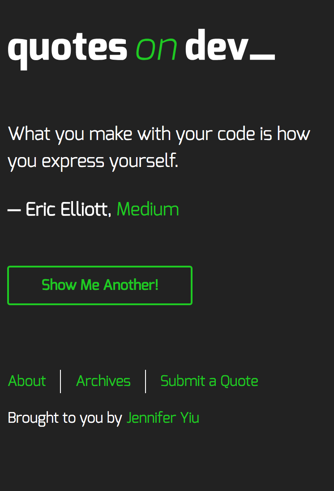
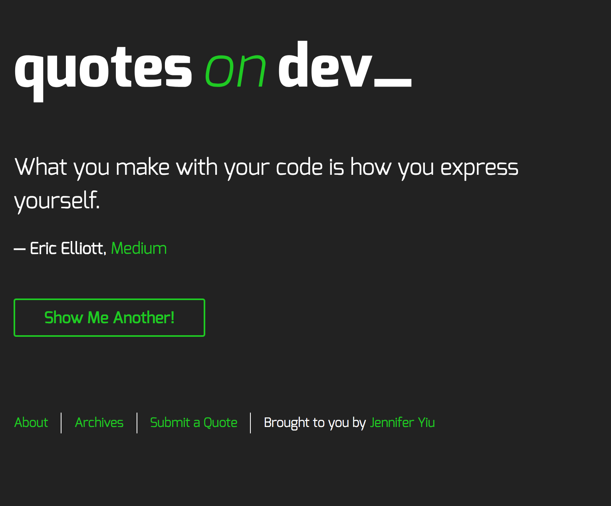
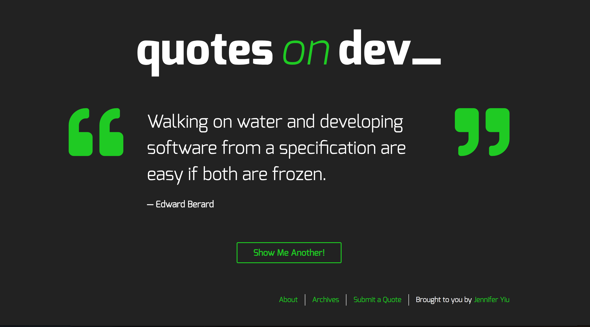

# Project 5: Quotes on Dev

Inhabitent Site is a multi-page website for a Inhabitent Camping Supply Co. Its objective is using WordPress as a content management system.

## **Technologies Used**

PHP, jQuery, HTML, CSS/SCSS, gulp, CLI, Wordpress CMS

## **Design**

Mobile-first, responsive design.

**Mobile**:



**Tablet**: breakpoint at `620px`



**Desktop**: breakpoint at `1080px`



## **Installation**

"Quotes on Dev" site requires [Node.js v4+][1] to run.

Install the dependencies and devDependencies and start the server.

```
$ cd wp-content/themes/inhabitent
$ npm install -d
$ gulp
```

[1]: https://nodejs.org/en/

## **License**

Learning materials content is copyright (c) 2018 RED Academy.
